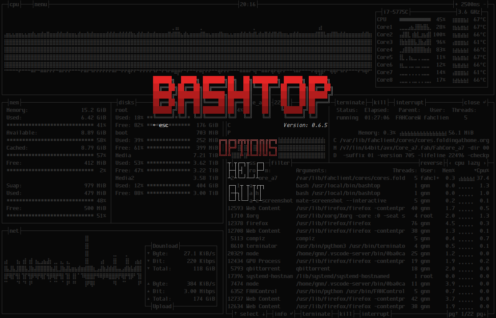
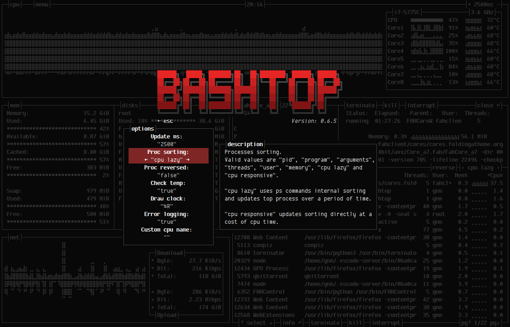

# 


[](https://travis-ci.com/aristocratos/bashtop)
[](https://paypal.me/aristocratos)
[](https://github.com/sponsors/aristocratos)
[](https://ko-fi.com/aristocratos)

### C++ Version

##### 18 September 2021


The C++ version of bashtop - btop++ is available.

Get it at https://github.com/aristocratos/btop

#

## Index

* [Documents](#documents)
* [Description](#description)
* [Features](#features)
* [Themes](#themes)
* [Support and funding](#support-and-funding)
* [Prerequisites](#prerequisites)
* [Dependencies](#dependencies)
* [Screenshots](#screenshots)
* [Installation](#installation)
* [Execution](#execution)
* [Configurability](#configurability)
* [TODO](#todo)
* [License](#license)


## Documents

#### [CHANGELOG.md](CHANGELOG.md)

#### [CONTRIBUTING.md](CONTRIBUTING.md)

#### [CODE_OF_CONDUCT.md](CODE_OF_CONDUCT.md)

## Description

Resource monitor that shows usage and stats for processor, memory, disks, network and processes.

## Features

* Easy to use, with a game inspired menu system.
* Fast and "mostly" responsive UI with UP, DOWN keys process selection.
* Function for showing detailed stats for selected process.
* Ability to filter processes.
* Easy switching between sorting options.
* Send SIGTERM, SIGKILL, SIGINT to selected process.
* UI menu for changing all config file options.
* Auto scaling graph for network usage.
* Shows message in menu if new version is available
* Shows current read and write speeds for disks
* Multiple data collection methods which can be switched if running on Linux

## Themes

Bashtop now has theme support and a function to download missing local themes from repository.

See [themes](themes) folder for available themes.

The builtin theme downloader places the default themes in `$HOME/.config/bashtop/themes`.
User created themes should be placed in `$HOME/.config/bashtop/user_themes` to be safe from overwrites.

Let me know if you want to contribute with new themes.

## Support and funding

Bug fixes and updates might be slow during normal workdays since I work full time as an industrial worker and don't have much time or energy left during the week.
I'm looking into ways of funding this project that would allow me to take off time from my day job to work on this.

Any advice on how to get funding for open source projects is very welcome!

#### Update

You can now sponsor this project through github, see [my sponsors page](https://github.com/sponsors/aristocratos) for options.

Also added donation links for [paypal](https://paypal.me/aristocratos) and [ko-fi](https://ko-fi.com/aristocratos).

Any support is greatly appreciated!

## Prerequisites

#### Mac Os X

Will not display correctly in the standard terminal!
Recommended alternative [iTerm2](https://www.iterm2.com/)

Will also need to be run as superuser to display stats for processes not owned by user.

#### Linux, Mac Os X and FreeBSD

For correct display, a terminal with support for:

* 24-bit truecolor ([See list of terminals with truecolor support](https://gist.github.com/XVilka/8346728))
* Wide characters (Are sometimes problematic in web-based terminals)

Also needs a UTF8 locale and a font that covers:

* Unicode Block “Braille Patterns” U+2800 - U+28FF
* Unicode Block “Geometric Shapes” U+25A0 - U+25FF
* Unicode Block "Box Drawing" and "Block Elements" U+2500 - U+259F

#### Notice

Dropbear seems to not be able to set correct locale. So if accessing bashtop over ssh, OpenSSH is recommended.

## Dependencies

## Linux, OSX and FreeBSD

**[bash](https://www.gnu.org/software/bash/)** (v4.4 or later) Script functionality will most probably break with earlier versions.
Bash version 5 is highly recommended to make use of $EPOCHREALTIME variable instead of a lot of external date command calls.

**[GNU coreutils](https://www.gnu.org/software/coreutils/)**

**[GNU sed](https://www.gnu.org/software/sed/)**

## Linux using /proc for data collection

**[GNU grep](https://www.gnu.org/software/grep/)**

**[ps from procps-ng](https://gitlab.com/procps-ng/procps)** (v3.1.15 or later)

**[GNU awk](https://www.gnu.org/software/gawk/)**

## OSX and FreeBSD or Linux using psutil for data collection

**[Python3](https://www.python.org/downloads/)** (v3.6 or later)

**[psutil python module](https://github.com/giampaolo/psutil)** (v5.7.0 or later)

## Optionals for additional stats

(Optional OSX) **[osx-cpu-temp](https://github.com/lavoiesl/osx-cpu-temp)** Needed to show CPU temperatures.

(Optional Linux) **[lm-sensors](https://github.com/lm-sensors/lm-sensors)** Needed to show CPU temperatures.

(Optional Linux) **[iostat (part of sysstat)](https://github.com/sysstat/sysstat)** Needed if you want disk read/write stats and are not using psutil data collection.

(Optional OSX/Linux/FreeBSD) **[curl](https://curl.haxx.se/download.html)** (v7.16.2 or later) Needed if you want messages about updates and the ability to download themes.

## Screenshots

Main UI showing details for a selected process.


Main menu.


Options menu.


## Installation

#### Dependencies installation OSX

>Install homebrew if not already installed

``` bash
/bin/bash -c "$(curl -fsSL https://raw.githubusercontent.com/Homebrew/install/master/install.sh)"
```


>If you got python 3.6 or later installed outside of brew:

``` bash
sudo python3 -m ensurepip
sudo python3 -m pip install psutil
```

>If you haven't got python3 installed:

```
brew install python3
python3 -m pip install psutil
```

>Install dependencies


``` bash
brew install bash coreutils gnu-sed git
```

>Install optional dependency osx-cpu-temp

``` bash
brew install osx-cpu-temp
```

#### Dependencies installation FreeBSD

>Install with pkg and pip

``` bash
sudo pkg install coreutils gsed git py37-psutil
```

#### Manual installation Linux, OSX and FreeBSD

>Clone and install

``` bash
git clone https://github.com/aristocratos/bashtop.git
cd bashtop
sudo make install
```

>to uninstall it

``` bash
sudo make uninstall
```

#### FreeBSD package

Available in [FreeBSD ports](https://www.freshports.org/sysutils/bashtop/)

Install pre-built pacakge

``` bash
sudo pkg install bashtop
```

#### Arch based

Available in the AUR as [bashtop-git](https://aur.archlinux.org/packages/bashtop-git/)

Available in the Arch Linux repository as [bashtop](https://www.archlinux.org/packages/community/any/bashtop/)

#### Debian based

Available in [official Debian repository](https://tracker.debian.org/pkg/bashtop) since Debian 11

Available for debian/ubuntu from [Azlux's repository](http://packages.azlux.fr/)

Or use quick installation:

>Quick install go to DEB  folder  and type

``` bash
 sudo ./build
```

>to uninstall it   go to DEB  folder  and type

``` bash
 sudo ./build --remove
```

#### Guix based

Available in [official Guix repository](https://git.savannah.gnu.org/cgit/guix.git/tree/gnu/packages/admin.scm) since 6bbd0fd2

>Installation

``` bash
guix install bashtop
```

#### Ubuntu based

Available in [official Ubuntu repository](https://launchpad.net/ubuntu/+source/bashtop) since Ubuntu 20.10

Available for Ubuntu from [PPA repository](https://code.launchpad.net/~bashtop-monitor/+archive/ubuntu/bashtop)

>Add PPA repository and install bashtop

``` bash
 sudo add-apt-repository ppa:bashtop-monitor/bashtop
 sudo apt update
 sudo apt install bashtop
```

#### Fedora

Available in the Fedora repository.

>Installation

``` bash
sudo dnf install bashtop
```

#### CentOS 8

>Installation

``` bash
dnf config-manager --set-enabled PowerTools
dnf install epel-release
dnf install bashtop
```

#### RHEL 8

>Installation

``` bash
ARCH=$( /bin/arch )
subscription-manager repos --enable
"codeready-builder-for-rhel-8-${ARCH}-rpms"
dnf install epel-release
dnf install bashtop
```

## Execution

``` bash
Execute that command to use Bashtop: bashtop

```

## Configurability

All options changeable from within UI.
Config files stored in "$HOME/.config/bashtop" folder

#### bashtop.cfg: (auto generated if not found)

```bash
#? Config file for bashtop v. 0.9.21

#* Color theme, looks for a .theme file in "$HOME/.config/bashtop/themes" and "$HOME/.config/bashtop/user_themes"
#* Should be prefixed with either "themes/" or "user_themes/" depending on location, "Default" for builtin default theme
color_theme="Default"

#* Update time in milliseconds, increases automatically if set below internal loops processing time, recommended 2000 ms or above for better sample times for graphs
update_ms="2500"

#* Processes sorting, "pid" "program" "arguments" "threads" "user" "memory" "cpu lazy" "cpu responsive"
#* "cpu lazy" updates sorting over time, "cpu responsive" updates sorting directly
proc_sorting="cpu lazy"

#* Reverse sorting order, "true" or "false"
proc_reversed="false"

#* Show processes as a tree
proc_tree="false"

#* Check cpu temperature, only works if "sensors", "vcgencmd" or "osx-cpu-temp" commands is available
check_temp="true"

#* Draw a clock at top of screen, formatting according to strftime, empty string to disable
draw_clock="%X"

#* Update main ui when menus are showing, set this to false if the menus is flickering too much for comfort
background_update="true"

#* Custom cpu model name, empty string to disable
custom_cpu_name=""

#* Enable error logging to "$HOME/.config/bashtop/error.log", "true" or "false"
error_logging="true"

#* Show color gradient in process list, "true" or "false"
proc_gradient="true"

#* If process cpu usage should be of the core it's running on or usage of the total available cpu power
proc_per_core="false"

#* Optional filter for shown disks, should be names of mountpoints, "root" replaces "/", separate multiple values with space
disks_filter=""

#* Enable check for new version from github.com/aristocratos/bashtop at start
update_check="true"

#* Enable graphs with double the horizontal resolution, increases cpu usage
hires_graphs="false"

#* Enable the use of psutil python3 module for data collection, default on OSX
use_psutil="true"
```

## TODO

Might finish off items out of order since I usually work on multiple at a time.

- [x] Add options to change colors for text, graphs and meters.
- [x] Fix cross platform compatibility for Mac OSX and *BSD: Working on OSX, and FreeBSD.
- [x] Add support for showing AMD cpu temperatures.
- [x] Add option to show tree view of processes.
- [x] Add option to reset network download/upload totals.
- [x] Add option to turn of gradient in processes list.
- [ ] Add gpu temp and usage. (If feasible)
- [x] Add io stats for disks.
- [ ] Add cpu and mem stats for docker containers. (If feasible)
- [x] Change process list to line scroll instead of page change.
- [ ] Add optional window for tailing log files.
- [ ] Add options for resizing all boxes.
- [ ] Add command line argument parsing.
- [ ] Builtin updater. Relevant PR #96 by Jukoo
- [ ] Add support for zram in memory box. Relevant PR #122 by perkinslr

- [ ] Miscellaneous optimizations and code cleanup.
- [ ] Add more commenting where it's sparse.

- [ ] Python port. (Porting started)

## LICENSE

[Apache License 2.0](LICENSE)
