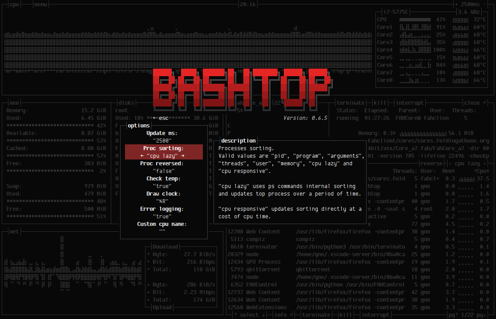

# 

**Usage:** Linux resource monitor  
**Language:** Bash  

## Description

Resource monitor that shows usage and stats for processor, memory, disks, network and processes.

## Features

* Easy to use, with a game inspired menu system.
* Fast and responsive UI with UP, DOWN keys process selection.
* Function for showing detailed stats for selected process.
* Ability to filter processes.
* Easy switching between sorting options.
* Send SIGTERM, SIGKILL, SIGINT to selected process.
* UI menu for changing all config file options.
* Auto scaling graph for network usage.

## Compability

Should work on most modern linux distributions with a truecolor capable terminal.

## Dependencies

**bash** (v4.4 or later) Script functionality will most probably break with earlier versions.  
Bash version 5 is higly recommended to make use of $EPOCHREALTIME variable instead of alot of external date command calls.

## Screenshots

Main UI showing details for a selected process.  


Main menu.  


Options menu.  


## Installation

Copy or link "bashtop" into PATH, or just run from cloned directory...

Also available in the AUR as [bashtop-git](https://aur.archlinux.org/packages/bashtop-git/)

Also available for debian/ubuntu from [Azlux's repository](http://packages.azlux.fr/)

## Configurability

All options changeable from within UI.
Config files stored in "$HOME/.config/bashtop" folder

#### bashtop.cfg: (auto generated if not found)

```bash
#? Config file for bashtop v. 0.6.5

#* Update time in milliseconds, increases automatically if set below internal loops processing time, recommended 2000 ms or above for better sample times for graphs
update_ms="2500"

#* Processes sorting, "pid" "program" "arguments" "threads" "user" "memory" "cpu lazy" "cpu responsive"
#* "cpu lazy" upates sorting over time, "cpu responsive" updates sorting directly at a cpu usage cost
proc_sorting="cpu lazy"

#* Reverse sorting order, "true" or "false"
proc_reversed="false"

#* Check cpu temperature, only works if "sensors" command is available and have values for "Package" and "Core"
check_temp="true"

#* Draw a clock at top of screen, formatting according to strftime, empty string to disable
draw_clock="%X"

#* Update main ui when menus are showing, set this to false if the menus is flickering too much for comfort
background_update="true"

#* Custom cpu model name, empty string to disable
custom_cpu_name=""

#* Enable error logging to "$HOME/.config/bashtop/error.log", "true" or "false"
error_logging="true"
```

#### Command line options: (not yet implemented)

```
USAGE: bashtop

```


## TODO


- [ ] TODO Add command line argument parsing.
- [ ] TODO Miscellaneous optimizations and code cleanup.
- [ ] TODO Add more commenting where it's sparse.


## LICENSE
[Apache License 2.0](LICENSE)
