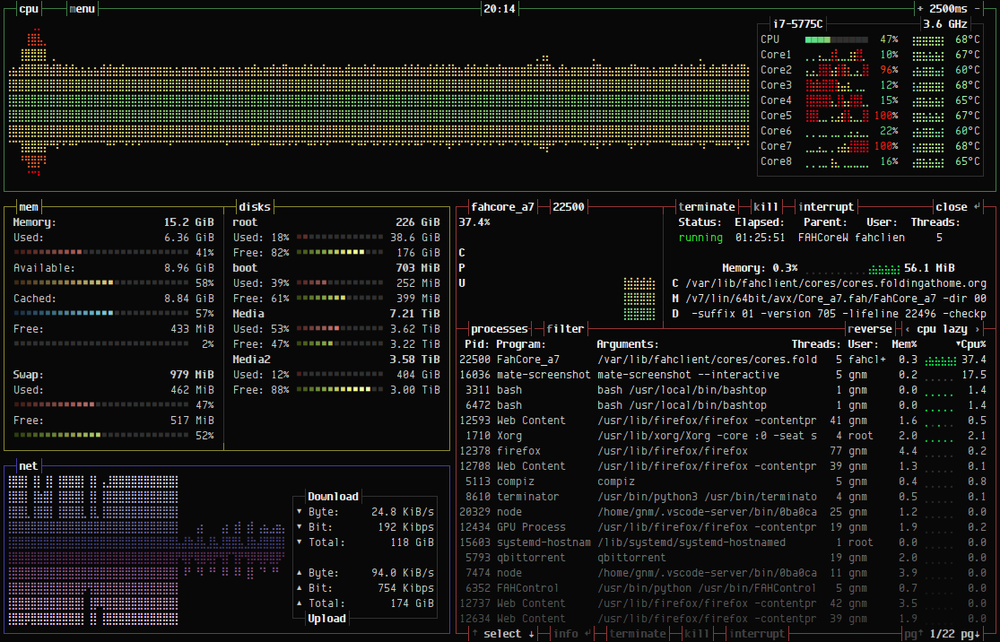

# 


[](https://paypal.me/aristocratos)
[](https://github.com/sponsors/aristocratos)
[](https://ko-fi.com/aristocratos)

## Index

* [Changelog](#changelog)
* [Description](#description)
* [Features](#features)
* [Themes](#themes)
* [Upcoming](#upcoming) (Updated)
* [Support and funding](#support-and-funding)
* [Compatibility](#compatibility) (Updated)
* [Dependencies](#dependencies) (Updated)
* [Screenshots](#screenshots)
* [Installation](#installation) (Updated)
* [Configurability](#configurability)
* [TODO](#todo)
* [License](#license)

## Changelog

#### [CHANGELOG.md](CHANGELOG.md)

## Description

Resource monitor that shows usage and stats for processor, memory, disks, network and processes.

## Features

* Easy to use, with a game inspired menu system.
* Fast and "mostly" responsive UI with UP, DOWN keys process selection.
* Function for showing detailed stats for selected process.
* Ability to filter processes.
* Easy switching between sorting options.
* Send SIGTERM, SIGKILL, SIGINT to selected process.
* UI menu for changing all config file options.
* Auto scaling graph for network usage.
* Shows message in menu if new version is available

## Themes

Bashtop now has theme support and a function to download missing local themes from repository.

See [themes](themes) folder for available themes.

Let me know if you want to contribute with new themes.

## Upcoming

#### (Mac OSX and *BSD support)

Currently rewriting to use python3 [psutil](https://github.com/giampaolo/psutil) for data collection instead of linux specific tools.
This will add python 3 and psutil as dependencies, but will make bashtop cross platform compatible.

~~This will be in a new branch called bashtop-psutil when I'm done with initial testing~~

This will be integrated in to main version when done and add the possibility to switch between psutil and linux tools for users running linux.

## Support and funding

Bug fixes and updates might be slow during normal workdays since I work full time as an industrial worker and don't have much time or energy left during the week.
I'm looking into ways of funding this project that would allow me to take off time from my day job to work on this.

Any advice on how to get funding for open source projects is very welcome!

#### Update

You can now sponsor this project through github, see [my sponsors page](https://github.com/sponsors/aristocratos) for options.

Also added donation links for [paypal](https://paypal.me/aristocratos) and [ko-fi](https://ko-fi.com/aristocratos).

Any support is greatly appreciated!

## Compatibility

Should work on most modern linux distributions.

For correct display, a terminal with support for:

* 24-bit truecolor
* Wide characters

Also needs a UTF8 locale and a font that covers:

* Unicode Block “Braille Patterns” U+2800 - U+28FF
* Unicode Block “Geometric Shapes” U+25A0 - U+25FF
* Unicode Block "Box Drawing" and "Block Elements" U+2500 - U+259F

#### Notice

Dropbear seems to not be able to set correct locale. So if accessing bashtop over ssh, OpenSSH is recommended.

## Dependencies

**[bash](https://www.gnu.org/software/bash/)** (v4.4 or later) Script functionality will most probably break with earlier versions.  
Bash version 5 is highly recommended to make use of $EPOCHREALTIME variable instead of a lot of external date command calls.

**[GNU Core Utilities](https://www.gnu.org/software/coreutils/)**

**[GNU Grep](https://www.gnu.org/software/grep/)**

**[ps from procps-ng](https://gitlab.com/procps-ng/procps)** (v3.1.15 or later)

**[sed](https://www.gnu.org/software/sed/)**

**[awk](https://www.gnu.org/software/gawk/)**

(Optional) **[lm-sensors](https://github.com/lm-sensors/lm-sensors)** Needed to show CPU temperatures

(Optional) **[curl](https://curl.haxx.se/download.html)** (v7.16.2 or later) Needed if you want messages about updates and the ability to download themes.

(Optional) **[iostat (part of sysstat)](https://github.com/sysstat/sysstat)** Needed if you want disk read/write stats

## Screenshots

Main UI showing details for a selected process.  


Main menu.  


Options menu.  


## Installation

#### Manual installation

Copy or link "bashtop" into PATH, or install with Makefile:

>From cloned directory

``` bash
 sudo make install
```

>to uninstall it

``` bash
 sudo make uninstall
```

#### Arch based

Available in the AUR as [bashtop-git](https://aur.archlinux.org/packages/bashtop-git/)

Available in the Arch Linux repository as [bashtop](https://www.archlinux.org/packages/community/any/bashtop/) (Flagged out-of-date on 2020-04-28)

#### Debian based

Available for debian/ubuntu from [Azlux's repository](http://packages.azlux.fr/)

Or use quick installation:

>Quick install go to DEB  folder  and type

``` bash
 sudo ./build
```

>to uninstall it   go to DEB  folder  and type

``` bash
 sudo ./build --remove
```

#### Ubuntu based

Available for Ubuntu from [PPA repository](https://code.launchpad.net/~bashtop-monitor/+archive/ubuntu/bashtop)

>Add PPA repository and install bashtop

``` bash
 sudo add-apt-repository ppa:bashtop-monitor/bashtop
 sudo apt update
 sudo apt install bashtop

```

#### Fedora

Available in the Fedora repository.

>Installation

``` bash
sudo dnf install bashtop
```

## Configurability

All options changeable from within UI.
Config files stored in "$HOME/.config/bashtop" folder

#### bashtop.cfg: (auto generated if not found)

```bash
#? Config file for bashtop v. 0.8.18

#* Color theme, looks for a .theme file in "$HOME/.config/bashtop/themes", "Default" for builtin default theme
color_theme="Default"

#* Update time in milliseconds, increases automatically if set below internal loops processing time, recommended 2000 ms or above for better sample times for graphs
update_ms="2500"

#* Processes sorting, "pid" "program" "arguments" "threads" "user" "memory" "cpu lazy" "cpu responsive"
#* "cpu lazy" updates sorting over time, "cpu responsive" updates sorting directly at a cpu usage cost
proc_sorting="cpu lazy"

#* Reverse sorting order, "true" or "false"
proc_reversed="false"

#* Check cpu temperature, only works if "sensors" command is available and have values for "Package" and "Core"
check_temp="true"

#* Draw a clock at top of screen, formatting according to strftime, empty string to disable
draw_clock="%X"

#* Update main ui when menus are showing, set this to false if the menus is flickering too much for comfort
background_update="true"

#* Custom cpu model name, empty string to disable
custom_cpu_name=""

#* Enable error logging to "$HOME/.config/bashtop/error.log", "true" or "false"
error_logging="true"

#* Show color gradient in process list, "true" or "false"
proc_gradient="true"

#* Optional filter for shown disks, should be names of mountpoints, "root" replaces "/", separate multiple values with space
disks_filter=""
```

#### Command line options: (not yet implemented)

``` bash
USAGE: bashtop

```

## TODO

Might finish off items out of order since I usually work on multiple at a time.

- [x] Add options to change colors for text, graphs and meters.
- [ ] Fix cross platform compatibility for Mac OSX and *BSD: Currently in testing, bashtop-psutil branch.
- [x] Add support for showing AMD cpu temperatures.
- [ ] Add option to show tree view of processes.
- [x] Add option to reset network download/upload totals.
- [x] Add option to turn of gradient in processes list.
- [ ] Add gpu temp and usage. (If feasible)
- [x] Add io stats for disks.
- [ ] Add options for resizing all boxes.
- [ ] Add command line argument parsing.
- [ ] Miscellaneous optimizations and code cleanup.
- [ ] Add more commenting where it's sparse.

## LICENSE

[Apache License 2.0](LICENSE)
